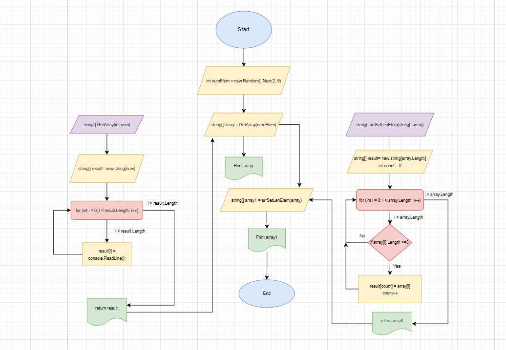

# **Описание решения задачи**

**Поставленная задача**

*Написать программу, которая из имеющего массива строк формирует массив из строк, длина которых меньше либо равно 3 символа. Первоначальный массив можно ввести с клавиатуры, либо задать на старте выполнения алгоритма. При решении не рекомендуется пользоваться коллекциями, лучше обойтись исключительно массивами.*

### Способ решения:

1. Создаём переменную типа int, с помощью генератора случайных чисел получаем число в диапозоне [2, 6). Эта переменная отвечает за длину массива.
2. Создаём функцию заполнения массива. С помощью цикла, просим пользователя заполнить массив, любыми данными.
3. Создаём массив и применяем для его заполнения нашу функцию и печатаем полученный массив c помощью метода, который с помощью цикла выводит на экран каждый элемент массива.
4. Создаём функцию, которая решает поставленную задачу. В функции создаём новый массив и заполнем его элементами, длина которых равно 3 или меньше.
5. Печатаем полученный масив через метод.

Ниже представлена блок-схема алгоритма

